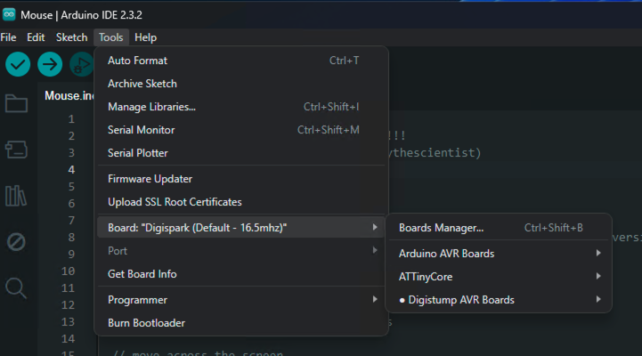
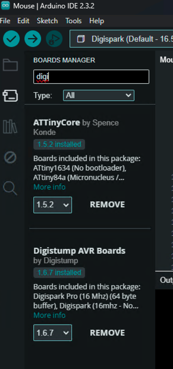
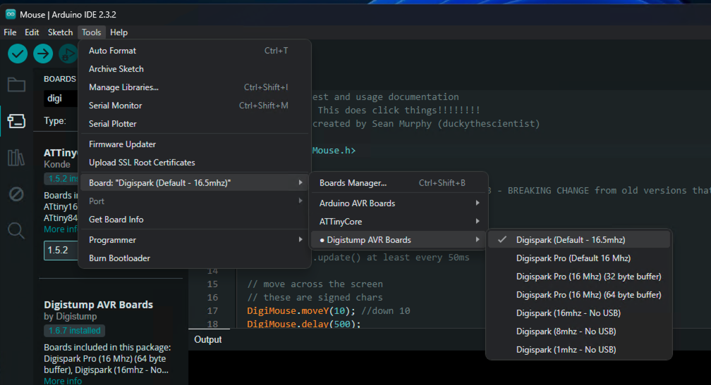
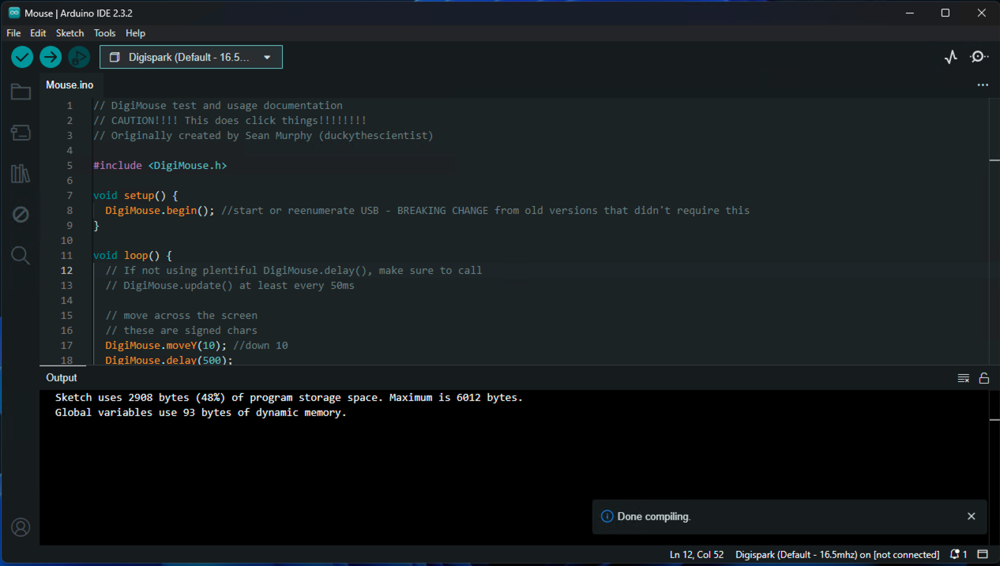
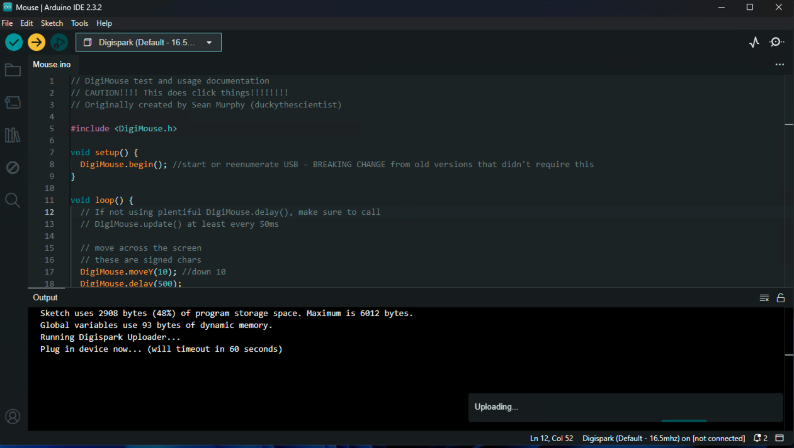
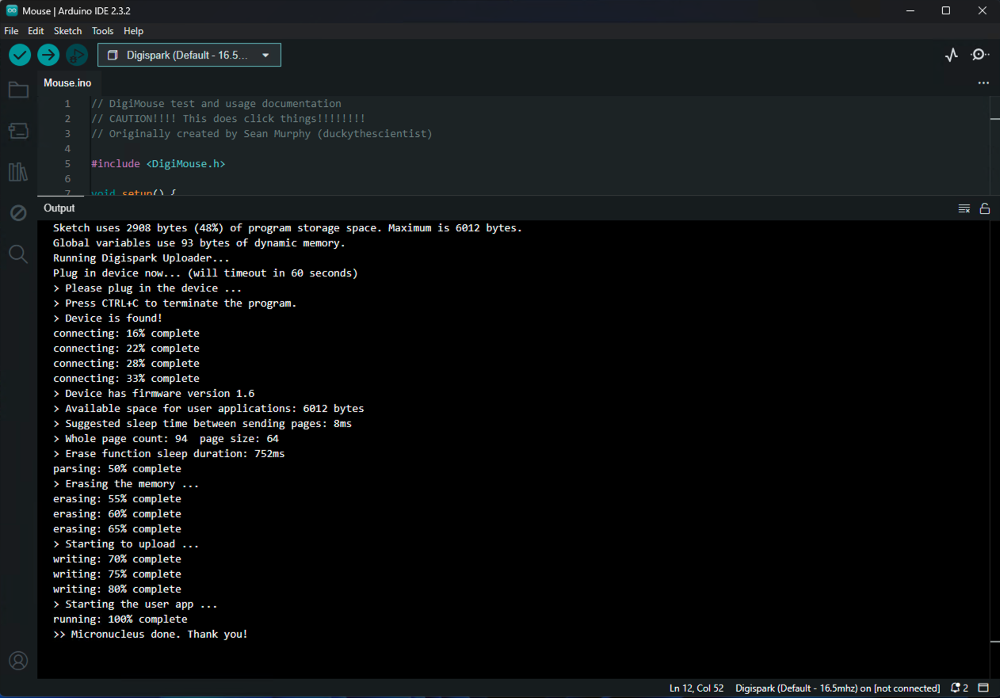

# Simulate keyboard strokes and mouse movements using Attiny85

Keyboard and mouse simulation using Digispark Attiny85 USB microcontroller.

## Instructions for installing firmware

- Install Arduino IDE
- Install Digispark Board
  - Goto File -> Preferences -> Settings -> Additional boards manager URLs: https://raw.githubusercontent.com/digistump/arduino-boards-index/master/package_digistump_index.json
  - Goto Tools -> Board -> Boards Manager

    

  - Search using keyword "Digi": Install "Digistump AVR Boards" 

    

- Select Board
  - Tools -> Board -> Digistump AVR Boards -> Digispark (Default - 16.5mhz)
  
    

- Open sketch [Mouse.ino](sketches/Mouse.ino) in Arduino IDE -> File -> Open
- Click on top left icon "Verify"

  

- Uploading Firmware
  - Make sure the USB device is disconnected
  - Click on "Upload"

    

  - Insert USB device within 60 seconds

    

  - You should see the following log

    ```
    Sketch uses 2908 bytes (48%) of program storage space. Maximum is 6012 bytes.
    Global variables use 93 bytes of dynamic memory.
    Running Digispark Uploader...
    Plug in device now... (will timeout in 60 seconds)
    > Please plug in the device ... 
    > Press CTRL+C to terminate the program.
    > Device is found!
    connecting: 16% complete
    connecting: 22% complete
    connecting: 28% complete
    connecting: 33% complete
    > Device has firmware version 1.6
    > Available space for user applications: 6012 bytes
    > Suggested sleep time between sending pages: 8ms
    > Whole page count: 94  page size: 64
    > Erase function sleep duration: 752ms
    parsing: 50% complete
    > Erasing the memory ...
    erasing: 55% complete
    erasing: 60% complete
    erasing: 65% complete
    > Starting to upload ...
    writing: 70% complete
    writing: 75% complete
    writing: 80% complete
    > Starting the user app ...
    running: 100% complete
    >> Micronucleus done. Thank you!
    ```

## References
https://github.com/chris408/digispark-usbkey-board

https://www.youtube.com/watch?v=eW9WgPlcPAw

https://forum.arduino.cc/t/digistump-avr-boards-not-available-in-arduino-ide-2-2-1/1189049
